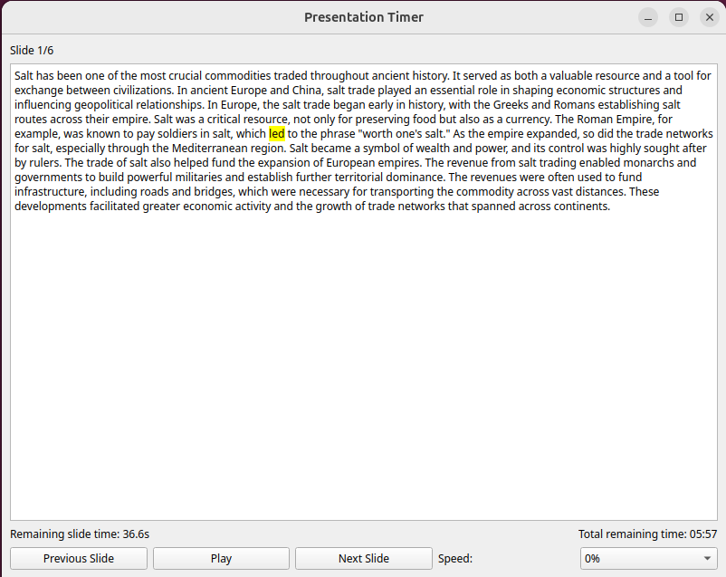

# Presentation Timer

A Python application designed to assist users with scripted presentations. It highlights the script in real-time based on natural speech pacing and provides an estimated countdown timer for remaining speech duration.



---

## Features

- **Real-time Script Highlighting:**
    - Highlights words dynamically based on natural human speech speed.

- **Speech Timing Estimation:**
    - Calculates remaining speech duration based on syllable counting, with additional pauses for punctuation.

- **Slide Management:**
    - Supports multi-slide presentations with clear separation using a `<---pagebreak--->` marker.
    - Displays current slide number and total slide count.

- **Playback Controls:**
    - Play/Pause functionality to control speech highlighting.
    - Navigate between slides easily with previous and next buttons.

- **Adjustable Speed Control:**
    - Adjust speech speed by ±20% with 10% increments to manage presentation pacing.

- **Interactive Selection:**
    - Double-click on any word to start from that position within a slide.

---

## Requirements

- Python 3.x
- PyQt5
- pyphen

---

## Installation

1. **Clone the repository:**

```bash
git clone https://github.com/yourusername/PresentationTimer.git
cd PresentationTimer
```

2. **Set up the virtual environment:**

```bash
python -m venv venv
source venv/bin/activate  # On Windows use: venv\Scripts\activate
```

3. **Install dependencies:**

```bash
pip install PyQt5 pyphen
```

---

## Usage

- Prepare your script text file, separating slides using:

```
Slide 1 text...

<---pagebreak--->

Slide 2 text...
```

- Run the application:

```bash
python main.py
```

- Use the GUI to control playback, navigate slides, adjust speed, and monitor the remaining speech time.

---

## GUI Overview

- **Slide Indicator:** Shows the current slide number and total slides.
- **Script Display:** Highlights current word.
- **Remaining Time:** Displays time left from the current highlight position.
- **Control Buttons:** Play/Pause, Previous Slide, Next Slide.
- **Speed Adjustment:** Dropdown to adjust presentation speed.

---

## License

This project is licensed under the MIT License.

